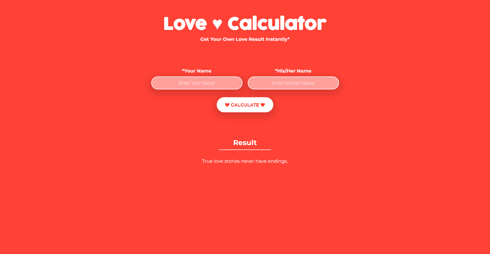

# Cute Love Calculator


## About

Welcome to the Cute Love Calculator project! 💖 This fun and adorable calculator help users find out their love compatibility by entering their names. Spread the love and enjoy the magic of romance!

## Features

- Simple and cute user interface
- Love compatibility calculation
- Spread love and smiles

## Getting Started

1. Clone the repository:

   ```bash
   git clone https://github.com/Saisudeep121521/Cute_Love_Calculator.git
   ```

2. Navigate to the project folder:

   ```bash
   cd Cute_Love_Calculator
   ```

3. Open the `index.html` file in your web browser or set up a local server.

## Screenshots

Add some screenshots or GIFs showcasing your love calculator in action.



## Contributors

- [Saisudeep](https://github.com/Saisudeep121521)

Feel free to explore the code, contribute, and spread the love! 💑🌟
